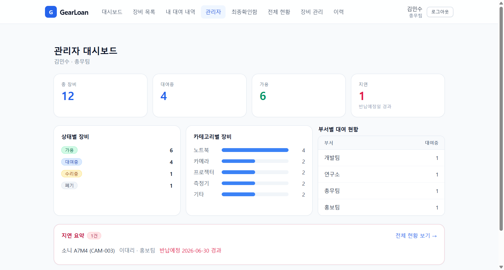
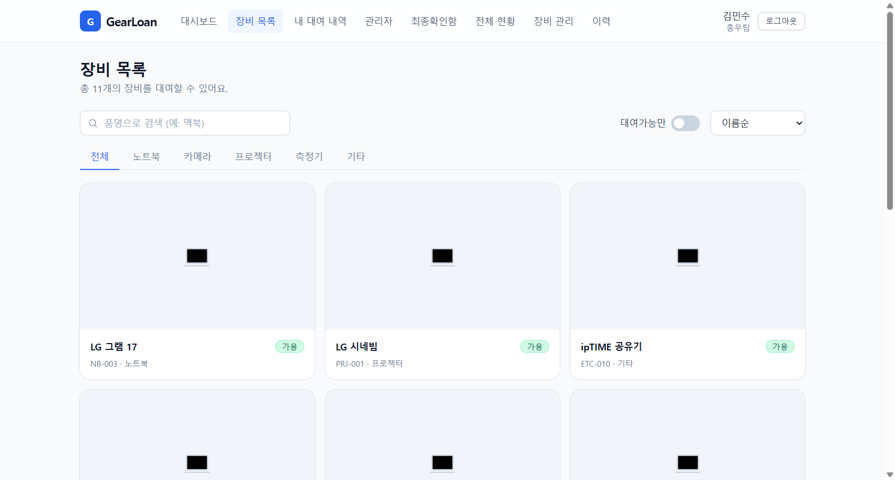
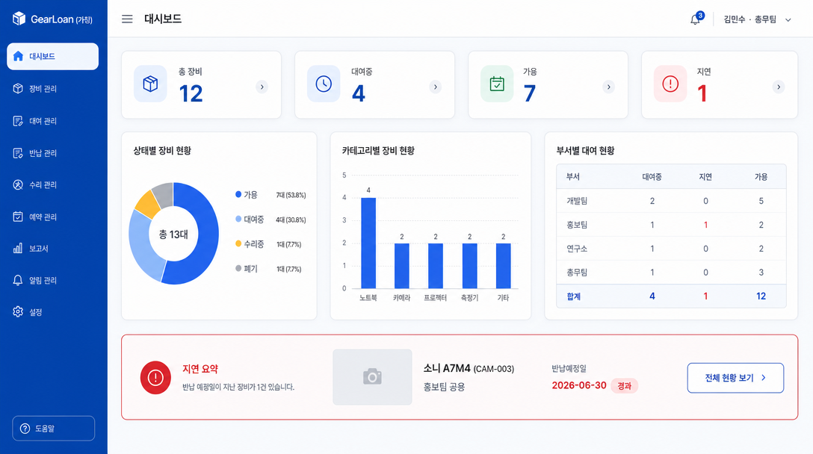
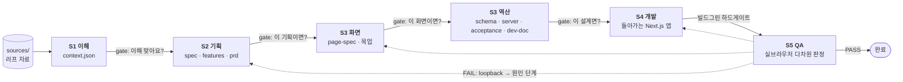
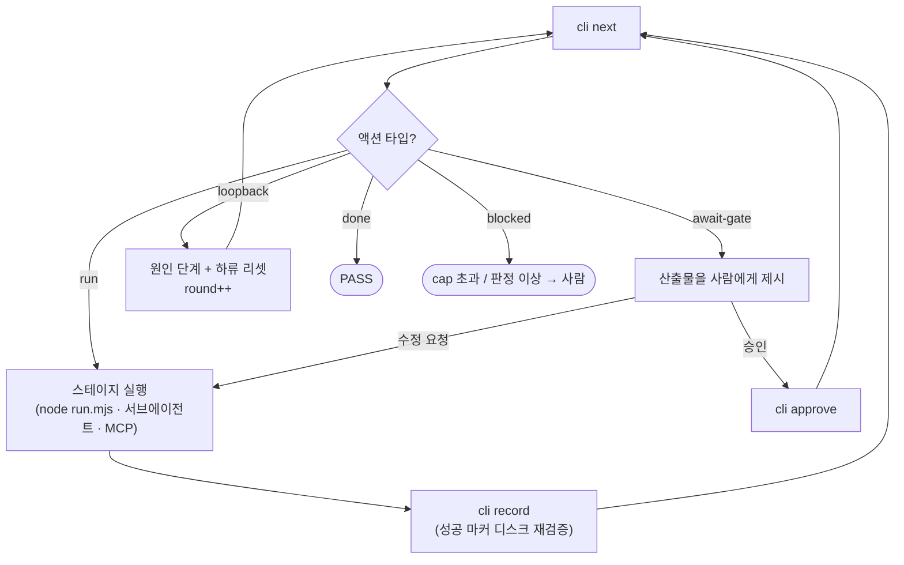
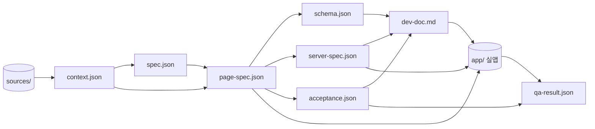

# poc-forge

> **계획 → *실제 돌아가는* 서비스.** 러프한 요구사항을 넣으면 S1~S5 파이프라인이 **실제로 빌드되고 돌아가는 Next.js 앱 + AI QA**까지 만들어내는 Claude Code 스킬.

정적 목업이 "이렇게 만들 겁니다"까지라면, poc-forge는 **"이렇게 *돌아갑니다*"**까지 — 데이터바인딩·필터·내비·서버 로직·접근제어가 진짜 작동하는 앱을 뽑고, AI가 실브라우저로 QA한다. **목업이 아니라 작동.**

---

## 결과 미리보기 — `gearloan` (사내 장비 대여 관리 · 3롤)

브리프·요구자료를 `sources/`에 넣고 파이프라인을 돌린 결과. **직원 / 팀장 / 총무** 3개 롤, **2단계 승인**(팀장 1차 → 총무 최종), 재고·반납기한·접근제어가 있는 실제 업무 시스템:

| S1 이해 | S2 기획 | S3 설계 | S4 개발 | S5 QA |
|---|---|---|---|---|
| 자료 정리·자산 등재 | 기능 **100행**(확정54/제안42)·규칙12 | 테이블7·API**29**·테스트**61**·화면12 | **빌드 그린**·라우트28·셀렉터59 | **94/94 PASS**(UI61·API29)·gap0 |

### S4가 실제로 빌드해 돌리는 앱 (실행 중 스크린샷)

**총무 관리자 대시보드** — 총 장비/대여중/가용/지연 KPI, 상태별·카테고리별 집계, 부서별 현황, 지연 하이라이트(전부 SQLite 실데이터):



**장비 목록** — 카드 그리드·카테고리 탭·품명 검색·가용 필터·정렬 (실제 동작):



### S3가 설계한 화면 목업 (gpt-image-2 + 디자인 시스템)

역산(DB·서버·테스트) 전에 사람이 승인하는 "피그마 시안". `knowledge/design-system/`의 톤·토큰이 주입돼 정갈한 모던 SaaS로 나온다 — 사이드바·KPI·도넛/바 차트·상태 배지가 실앱과 같은 디자인 언어:



### ★ QA가 잡은 것 — teaching-to-test 방지 (루프백 실증)

S5는 UI 테스트만 통과시키지 않는다. **API 엔드포인트를 직접 타격**해 상태·**접근제어**·규칙강제를 검증한다:

> round-1: UI 61/61 그린인데 **API 직접 타격이 서버 계약 구멍을 포착** — `/api/announcements`에 인증 가드 누락(미인증 200). → `qa-result.json`이 **원인 단계 S4로 루프백** → 수정 → round-2 **94/94 PASS·gap 0**.

UI만 봤으면 놓쳤을 접근제어 결함을 API 차원이 잡아내고, 파이프라인이 스스로 원인 단계로 되돌려 고친 뒤 재검증했다. **이게 "목업"과 "작동하는 서비스"의 차이.**

---

## 파이프라인 흐름

5개 컴포넌트(각각 독립 실행 가능한 스킬)를 **순서 · 사람 게이트 · 빌드그린 · 루프백**을 코드로 강제하며 엮는다.



- **완전 순차 + 화면 역산**: DB·서버·테스트는 spec이 아니라 **승인된 화면(page-spec)을 역산**해 만든다.
- **누적 맥락**: 각 스테이지는 직전만이 아니라 *이전 전부*의 계약을 보유한다.
- **연결 = 계약 파일**(대화 아님). 한 스테이지 OUT → 다음 스테이지 IN.

## 각 스킬의 역할 · 계약 · 구동

각 컴포넌트 스킬 = `SKILL.md`(Claude 진입점) + `run.mjs`(오케) + `guard.mjs`(코드 가드) + `prompt-*.md`. **독립 실행 가능**하고, 계약 파일로 연결된다.

### S1 · understand (이해·정리)
- **역할**: ① 러프 자료를 통일 정리·이해(모순·빈틈은 지어내지 않고 **표면화**) ② 뒤 단계가 꺼내 쓸 원자료를 **자산으로 등재**(요약만 하고 원본 안 버림).
- **IN** `sources/*` (텍스트=본문 정독, pdf·엑셀·이미지=목록만 등재) → **OUT** `context.json`(기계) + `understanding.md`(사람).
- **구동**: `node skills/s1-understand/run.mjs <project>` → intake(truncate 없음) → LLM(lean 프롬프트) → **guard**(근거 무결·**자산 커버리지 100%**·스키마).

### S2 · plan (기획)
- **역할**: "엑셀 한 줄씩 관리할" **행-granularity 기능정의서**(버튼·상태·검증·상호작용 하나하나가 개별 행) + PRD. 정책·NFR은 originate 아니라 **extract**.
- **IN** `context.json`(+원자료 전량) → **OUT** `spec.json`(backbone) + `features.md`(표) + `prd.md`(내러티브).
- **구동**: LLM 2콜(spec 스키마강제 → prd 프로즈) + 렌더. **guard**: 계층·상세 강제·근거·`confirmed`는 근거+테스트씨앗 필수. "자세히"의 안전장치 = `status`(confirmed 소스근거 / proposed 도메인상식+가정 / open 미정).

### S3 · design (설계) — ★가장 무거움 · 2페이즈 + 내부 화면 게이트
- **역할**: UI/UX 화면 → **사람 승인** → DB·서버·테스트 **역산** → 개발문서.
- **phase ui**: `--phase=ui` → `page-spec.json`(IA·페이지·필드·상태·권한·플로우) + `screens/*.png`(gpt 목업) → **화면 게이트에서 멈춤**.
- **phase design**: `--phase=design` → 승인된 page-spec 역산 4콜: `schema.json` · `server-spec.json` · `acceptance.json` · `dev-doc.md`.
- **커버리지 가드(코드)**: confirmed 기능→화면(hard)·기능→테스트≥1(hard·바닥)·**BR 전부 server/acceptance 반영(hard)**·assert data-testid→셀렉터 계약. 화면-first가 비가시 명세(상태머신·이력·부서·알림)를 안 떨구게.

### S4 · build (개발)
- **역할**: 설계대로 **실제 동작하는** Next.js(App Router)+SQLite 앱 생성 + **빌드 그린 하드게이트**.
- **IN** `dev-doc` · `page-spec` · `schema` · `server-spec` · `acceptance` → **OUT** `app/` + `next build` exit 0.
- **구동**: 결정적 스캐폴딩 → **레이어드 코드젠**(enums→schema→seed / 도메인lib / api / ui→layout / pages; 각 레이어가 앞 레이어의 *실제 export 표면*을 봄=드리프트 방지) → `npm install`→`next build`→자동복구 루프 → **guard**(빌드그린·셀렉터 계약·라우트 커버리지).

### S5 · qa (QA) — 러너 = chrome-devtools MCP
- **역할**: **다차원 판정** ①UI(바닥) ②**API 엔드포인트**(상태·접근제어·규칙강제) ③적대 ④spec 대비 폭. teaching-to-test 방지.
- **IN** `acceptance` · `spec` · `page-spec` · `app/` → **OUT** `qa-result.json`(pass/fail + gap + loopback).
- **구동(3분할)**: `run.mjs prep`(DB wipe·clean build·서버 기동·대본 생성) → **Claude가 MCP로 실브라우저 구동**(Discover→UI→API→적대→폭) → `run.mjs finalize`(검증·판정·**루프백 라우팅**·렌더). 실패면 원인 단계로 되돌린다.

## 오케스트레이터 — 얇은 "두뇌"

`orchestrator/`(pipeline·engine·cli) + 루트 `SKILL.md`. **엔진은 "다음 뭐할지"를 결정만** 하고(순수 함수·단위검증), 실제 실행은 Claude가 한다. `runs/<p>/poc.manifest.json`에 상태 저장.



- **no-skip**: 상류가 done + 게이트 승인이어야 다음. **신선도**: 상류 계약이 바뀌면 하류를 `stale` 표시(재승인 요구). **루프백 cap**(기본 2) 초과 시 사람 개입.

## 계약 파일 체인 (데이터 의존)



## 디자인 시스템

`knowledge/design-system/` — 색만이 아니라 **디자인을 *생성*하는 로직·프롬프트**를 vendor: `tone/`(밀도·여백·위계) · `tokens.md`(팔레트·라운드·그림자·타이포·간격·컴포넌트 언어 + 프롬프트 주입 블록) · `gen-logic.md`(피그마 목업 프레이밍·화면유형별 구성·브랜드 안전·레퍼런스 체이닝). → **S3 목업 프롬프트**와 **S4 앱 스캐폴드/코드젠** 양쪽에 주입. 브랜드색만 프로젝트에서 도출(도메인 불가지).

## 구조

```
poc-forge/
  DESIGN.md            설계 SSOT (정체성·원칙·계약)
  SKILL.md             오케스트레이터 진입점 (Claude 런북)
  orchestrator/        얇은 엔진: pipeline · engine · cli (+ test)
  skills/
    s1-understand/     각 스킬 = SKILL.md + run.mjs + guard.mjs + prompt-*.md
    s2-plan/  s3-design/  s4-build/  s5-qa/
  lib/                 공용: version · llm · clean · chunk
  knowledge/           디자인 시스템 등 vendor
  runs/<project>/      프로젝트별 산출물 (실행 시 생성 — git 추적 안 함)
```

## 실행법

### 요구사항
- **Node.js** (v20+ 권장)
- **[Claude Code](https://claude.com/claude-code) CLI** — 기본 LLM 엔진(`claude -p`). `POC_FORGE_LLM_CMD`로 교체 가능
- (선택) **`FAL_KEY`** — S3 화면 목업 이미지(fal.ai `gpt-image-2`). 없으면 목업만 건너뜀
- (S5 QA) **chrome-devtools MCP** 서버가 Claude Code에 연결돼 있어야 함

### 환경변수
`.env.example` 참고 — 코드가 읽는 건 `POC_FORGE_LLM_CMD`·`FAL_KEY` 2개뿐. 셸 환경변수로:
```bash
export POC_FORGE_LLM_CMD="claude -p"   # 기본값
export FAL_KEY="..."                    # 선택 (S3 목업)
```

### 실행
```bash
# 1) 자료 넣기
mkdir -p runs/myproject/sources          # 요구사항·브리프·엑셀·화면기획 등을 넣는다

# 2) 오케스트레이터로 (권장) — 루트 SKILL.md 를 Claude Code에서 "poc-forge 돌려"로 부르거나:
node orchestrator/cli.mjs init    myproject [--auto]   # manifest 생성 (--auto=무인)
node orchestrator/cli.mjs next    myproject            # 다음 액션(JSON)
node orchestrator/cli.mjs record  myproject <step> 0   # 결과 기록(마커 재검증)
node orchestrator/cli.mjs approve myproject <step>     # 사람 게이트 승인
node orchestrator/cli.mjs status  myproject            # 상태

# 3) 스테이지 단독 (디버깅) — 계약 파일로 연결되므로 독립 실행 가능
node skills/s1-understand/run.mjs myproject
node skills/s2-plan/run.mjs       myproject
node skills/s3-design/run.mjs     myproject --phase=ui       # → (사람 승인) →
node skills/s3-design/run.mjs     myproject --phase=design
node skills/s4-build/run.mjs      myproject
node skills/s5-qa/run.mjs prep    myproject                  # → (Claude가 MCP로 구동) →
node skills/s5-qa/run.mjs finalize myproject
```

## 핵심 원칙 (값비싼 교훈)

1. **전체 데이터 다 넣고, 규칙은 적게, 모델을 신뢰.** 프롬프트 = 역할 + 출력 스키마 + 필수 2~3개. 입력 truncate 금지.
2. **extract not originate** — 실제 납품 포맷/제안을 추출·소비, 중복 구현 X.
3. **test는 바닥이지 천장이 아님** — QA는 이중(바닥 + 폭).
4. **완전 순차 + 화면 역산** — DB·서버·test는 승인된 화면을 역산.
5. **가드는 프롬프트가 아니라 코드로** — no-skip · 커버리지(silent-drop 금지) · 근거 · 빌드그린 · 루프백.
6. **얇게 · 도메인 불가지** — 특정 도메인 하드코딩 금지. 컴포넌트 독립 실행.

## 상태

연구/실험 단계 파이프라인. S1~S5 + 오케스트레이터 빌드 완료, `gearloan`(사내 장비 대여)으로 전 파이프라인 검증(S5 94/94 PASS + 루프백 완주). 실행 호스트에 따라 다중 LLM 콜 스테이지는 시간이 걸릴 수 있다.

## 크레딧

디자인 시스템 톤·토큰·생성 로직은 사내 dealcatch 제안서 자동화 포맷에서 distill/vendor. 이미지 모델 = fal.ai `openai/gpt-image-2`.
