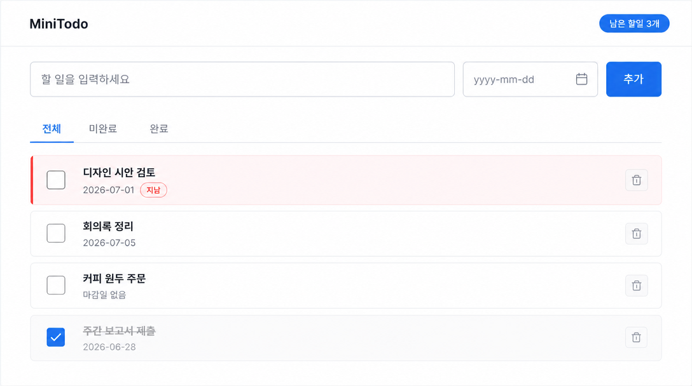
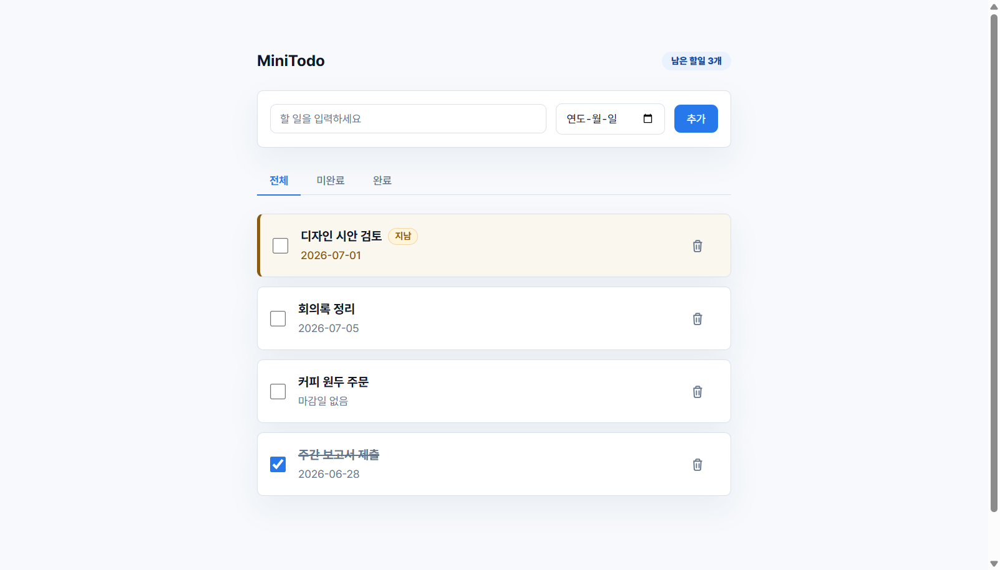

# poc-forge

> **계획 → *실제 돌아가는* 서비스.** 러프한 요구사항을 넣으면 S1~S5 파이프라인이 **실제로 빌드되고 돌아가는 Next.js 앱 + AI QA**까지 만들어내는 Claude Code 스킬.

정적 목업이 "이렇게 만들 겁니다"까지라면, poc-forge는 **"이렇게 *돌아갑니다*"**까지 — 데이터바인딩·필터·내비·서버 로직이 진짜 작동하는 앱을 뽑고, AI가 실브라우저로 QA한다. **목업이 아니라 작동.**

---

## 결과 미리보기 — `minitodo` (초경량 팀 할일 앱)

브리프 1장(인증 없는 공용 할일 목록, 추가·필터·완료·삭제·남은개수)을 `sources/`에 넣고 파이프라인을 **무인(`--auto`) 모드로 완주**시킨 결과:

| S1 이해 | S2 기획 | S3 설계 | S4 개발 | S5 QA |
|---|---|---|---|---|
| facts 16 | 기능 **38행**(확정32/제안5/미정1)·규칙8 | 테이블1·API5·**테스트44**·화면2 | **첫 빌드 그린**·셀렉터20/20·route4 | **59/59 PASS**(UI44·API5·적대16·폭4)·gap0 |

**S3가 생성한 화면 목업 (gpt-image-2)** — 디자인 시스템이 주입된 "피그마 시안" 느낌:



**S4가 실제로 빌드한 앱** (`next build` 그린, 실행 중 스크린샷) — **목업과 같은 디자인 언어**:



> 목업(설계)과 실앱(구현)이 하나의 디자인 시스템을 공유 — pill 배지·시맨틱 틴트(지난 마감 강조)·필터탭 언더라인·카드 행·Pretendard. 데이터·필터·완료 토글·삭제가 SQLite 위에서 실제로 동작하고, API 접근제어·규칙강제까지 AI QA로 검증된다.

---

## 무엇을 하나

5개 컴포넌트(각각 독립 실행 가능한 스킬)를 **순서·사람 게이트·빌드그린·루프백**을 코드로 강제하며 엮는다:

```
S1 이해 ─▶ S2 기획 ─▶ S3 설계 ─▶ S4 개발 ─▶ S5 QA
 정리·자산    기능정의서    화면+DB+API    돌아가는        실브라우저
 등록         +PRD          +테스트 설계    Next.js 앱      다차원 판정
 [gate]       [gate]        [gate]         [빌드그린]      [loopback→원인단계]
```

- **S1 understand** — 러프 자료를 통일 정리·이해하고(모순·빈틈은 지어내지 않고 표면화) 원자료를 자산으로 등재 → `context.json`
- **S2 plan** — "엑셀 한 줄씩 관리할" 행-granularity 기능정의서 + PRD → `spec.json`·`features.md`·`prd.md`
- **S3 design** — UI/UX 화면(+gpt 목업) → 사람 승인 → DB·서버·테스트 역산 + 개발문서 → `page-spec`·`schema`·`server-spec`·`acceptance`·`dev-doc`
- **S4 build** — 설계대로 **실제 동작하는** Next.js(App Router)+SQLite 앱 생성 + **빌드 그린 하드게이트**
- **S5 qa** — 실브라우저(chrome-devtools MCP)로 UI·API·적대·폭 다차원 판정. teaching-to-test 방지. 실패면 원인 단계로 **루프백**

**오케스트레이터**(`orchestrator/` + 루트 `SKILL.md`)는 얇은 "두뇌" — manifest로 다음 액션·no-skip·사람게이트·신선도·루프백을 **판단만** 하고, 실행(스테이지·QA 구동·게이트)은 Claude가 한다.

## 디자인 시스템

`knowledge/design-system/` — 색만이 아니라 **디자인을 *생성*하는 로직·프롬프트**를 vendor:
- `tone/` — 밀도·여백·정보 위계 규율
- `tokens.md` — 팔레트·라운드·그림자·타이포·간격·컴포넌트 언어 (+ 프롬프트 주입 블록)
- `gen-logic.md` — 피그마 목업 프레이밍·화면유형별 구성·브랜드 안전·레퍼런스 체이닝

→ **S3 목업 프롬프트**와 **S4 앱 스캐폴드/코드젠** 양쪽에 주입 → 설계와 구현이 같은 미감. 브랜드색만 프로젝트에서 도출(도메인 불가지).

## 구조

```
poc-forge/
  DESIGN.md            설계 SSOT (정체성·원칙·계약)
  SKILL.md             오케스트레이터 진입점 (Claude 런북)
  orchestrator/        얇은 엔진 (pipeline·engine·cli) — 순서·게이트·루프백·신선도
  skills/
    s1-understand/     각 컴포넌트 스킬 = SKILL.md + run.mjs + guard.mjs + prompt
    s2-plan/
    s3-design/
    s4-build/
    s5-qa/
  lib/                 공용 (version·llm·clean·chunk)
  knowledge/           디자인 시스템 등 vendor
  runs/<project>/      프로젝트별 산출물 (실행 시 생성 — git 추적 안 함)
```

## 실행법

### 요구사항
- **Node.js** (v20+ 권장)
- **[Claude Code](https://claude.com/claude-code) CLI** — 기본 LLM 엔진(`claude -p`). `POC_FORGE_LLM_CMD`로 교체 가능
- (선택) **`FAL_KEY`** — S3 화면 목업 이미지(fal.ai `gpt-image-2`). 없으면 목업만 건너뜀
- (S5 QA) **chrome-devtools MCP** 서버가 Claude Code에 연결돼 있어야 함

### 환경변수
`.env.example` 참고. 코드가 읽는 건 `POC_FORGE_LLM_CMD`·`FAL_KEY` 2개뿐. 셸 환경변수로 export 하세요:
```bash
export POC_FORGE_LLM_CMD="claude -p"     # 기본값
export FAL_KEY="..."                      # 선택 (S3 목업용)
```

### 1) 자료 넣기
```bash
mkdir -p runs/myproject/sources
# 요구사항·브리프·엑셀·화면기획 등을 sources/ 에 넣는다 (텍스트=정독, pdf/이미지=목록 등재)
```

### 2) 오케스트레이터로 (권장)
루트 `SKILL.md`를 Claude Code에서 "poc-forge 돌려"로 부르거나, 얇은 CLI로 직접 구동:
```bash
node orchestrator/cli.mjs init   myproject           # manifest 생성 (--auto = 무인/게이트 자동승인)
node orchestrator/cli.mjs next   myproject           # 다음 할 액션(JSON)
# → 안내대로 스테이지 실행 후:
node orchestrator/cli.mjs record  myproject <step> 0 # 결과 기록 (마커 재검증)
node orchestrator/cli.mjs approve myproject <step>   # 사람 게이트 승인
node orchestrator/cli.mjs status  myproject          # 상태 요약
node orchestrator/cli.mjs list                       # 전 프로젝트
```

### 3) 스테이지 단독 실행 (디버깅)
각 스킬은 독립 실행 가능 — 계약 파일로 연결된다:
```bash
node skills/s1-understand/run.mjs myproject
node skills/s2-plan/run.mjs       myproject
node skills/s3-design/run.mjs     myproject --phase=ui      # 화면 → (사람 승인) →
node skills/s3-design/run.mjs     myproject --phase=design  # DB/서버/테스트 역산
node skills/s4-build/run.mjs      myproject                 # 앱 빌드(그린 게이트)
node skills/s5-qa/run.mjs prep    myproject                 # QA 서버 준비 → (Claude가 MCP로 구동) →
node skills/s5-qa/run.mjs finalize myproject                # QA 판정·루프백
```

## 핵심 원칙 (값비싼 교훈)

1. **전체 데이터 다 넣고, 규칙은 적게, 모델을 신뢰.** 프롬프트 = 역할 + 출력 스키마 + 필수 2~3개. 입력 truncate 금지.
2. **extract not originate** — 실제 납품 포맷/제안을 추출·소비, 중복 구현 X.
3. **test는 바닥이지 천장이 아님** — QA는 이중(바닥 + 폭).
4. **완전 순차 + 화면 역산** — DB·서버·test는 승인된 화면을 역산.
5. **가드는 프롬프트가 아니라 코드로** — no-skip·커버리지·근거·빌드그린·루프백.
6. **얇게·도메인 불가지** — 특정 도메인 하드코딩 금지.

## 상태

연구/실험 단계의 파이프라인. S1~S5 + 오케스트레이터 빌드 완료, `minitodo`로 전 파이프라인 무인 완주(S5 PASS) 검증. 실행 환경(호스트)에 따라 다중 LLM 콜 스테이지는 시간이 걸릴 수 있다.

## 크레딧

디자인 시스템 톤·토큰·생성 로직은 사내 dealcatch 제안서 자동화 포맷에서 distill/vendor. 이미지 모델 = fal.ai `openai/gpt-image-2`.
